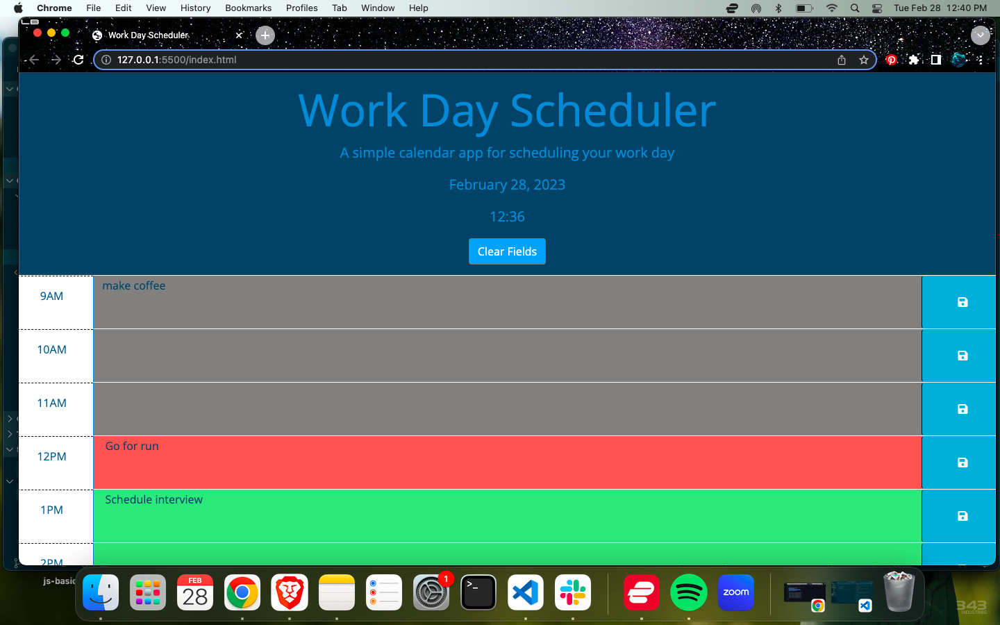

# <Calendar-App>

## Description

Used existing starter code to create a functioning day planner app that users can save their events and come back to even if they have left the app. Utilized local storage to create this feature.

## Code and Tech

I utilized VS Code in order to modify the exisiting HTML, CSS, and JS files to create a functioning application. 

## Features

Applied functions and concepts recently learned to use local storage to store the users info in the application. Other features include the following:

-The user can utilize time blocks from 9AM - 5PM and insert text accordingly
-Time blocks are color coded by past, present, and future 
(gray, red, green)
-Local storage saves the users data
-Clear fields button allows user to clear all data and begin again

## Mock-Up

The user can click the "Start Quiz" button to play the quiz game
The webpage can be found at 
 https://taylor-green.github.io/Coding-Quiz/

## License

MIT License

Copyright (c) [2023] [TaylorGreen]

Permission is hereby granted, free of charge, to any person obtaining a copy
of this software and associated documentation files (the "Software"), to deal
in the Software without restriction, including without limitation the rights
to use, copy, modify, merge, publish, distribute, sublicense, and/or sell
copies of the Software, and to permit persons to whom the Software is
furnished to do so, subject to the following conditions:

The above copyright notice and this permission notice shall be included in all
copies or substantial portions of the Software.

THE SOFTWARE IS PROVIDED "AS IS", WITHOUT WARRANTY OF ANY KIND, EXPRESS OR
IMPLIED, INCLUDING BUT NOT LIMITED TO THE WARRANTIES OF MERCHANTABILITY,
FITNESS FOR A PARTICULAR PURPOSE AND NONINFRINGEMENT. IN NO EVENT SHALL THE
AUTHORS OR COPYRIGHT HOLDERS BE LIABLE FOR ANY CLAIM, DAMAGES OR OTHER
LIABILITY, WHETHER IN AN ACTION OF CONTRACT, TORT OR OTHERWISE, ARISING FROM,
OUT OF OR IN CONNECTION WITH THE SOFTWARE OR THE USE OR OTHER DEALINGS IN THE
SOFTWARE.